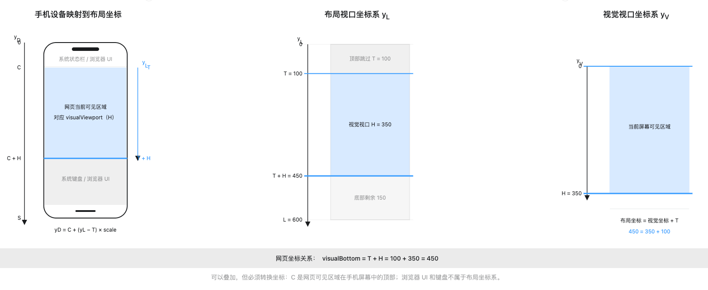

# 移动端软键盘为什么总把弹窗顶歪：VisualViewport 坐标系、iOS/Android 差异与完整排错复盘

> 📅 创建时间：2026-09-01  
> 👤 作者：CQ

这次问题最初并不是键盘与弹窗之间“漏空”，而是输入框失焦后重新聚焦时，Drawer 下半部分被键盘遮挡。为了补足重新聚焦时的上移距离，代码随后增强了键盘补偿，却又在初次点击 Prompt 时引入 Drawer 与键盘之间的空隙。后续调试一直在“补偿不足导致遮挡”和“补偿过度或更新不同步导致漏空”之间切换。

本文按真实发生顺序复盘这组互相牵制的问题：先解决重新聚焦遮挡，再定位由修复引入的初次点击漏空，最后让同一套处理同时覆盖两个场景。重点不是记住一个“万能键盘高度公式”，而是建立一套可以在 iOS、Android、普通浏览器和 WebView 中验证的坐标模型。

## 一张图看完整排查过程

```text
┌─────────────────────────────────────────────────┐
│ 原始问题：iOS 失焦后重新聚焦，Drawer 下部被遮挡 │
└───────────────────────┬─────────────────────────┘
                        ▼
┌─────────────────────────────────────────────────┐
│ 第一次修正：增加 Drawer 的键盘上移补偿           │
└───────────────────────┬─────────────────────────┘
                        ▼
┌─────────────────────────────────────────────────┐
│ 新回归：初次点击 Prompt 时，Drawer 与键盘漏空    │
└───────────────────────┬─────────────────────────┘
                        ▼
┌─────────────────────────────────────────────────┐
│ 反复调参：补偿减小会重新遮挡，补偿增大又会漏空   │
└───────────────────────┬─────────────────────────┘
                        ▼
┌─────────────────────────────────────────────────┐
│ 增加真机调试面板，按事件持续打印 L、H、T         │
└────────────────┬───────────────────┬────────────┘
                 ▼                   ▼
       ┌─────────────────┐  ┌──────────────────────┐
       │ Android         │  │ iOS 重新聚焦         │
       │ T = 0           │  │ L = L₀ - T           │
       │ L = H           │  │ L - H > 0            │
       └────────┬────────┘  └──────────┬───────────┘
                └────────────┬─────────┘
                             ▼
┌─────────────────────────────────────────────────┐
│ 收敛：bottomInset 是当前额外避让量，不是键盘高度 │
│ iOS：max(0, L - H)；Android：0                  │
└───────────────────────┬─────────────────────────┘
                        ▼
┌─────────────────────────────────────────────────┐
│ 键盘打开状态另算，并同步 window/vv 的三类事件    │
└─────────────────────────────────────────────────┘
```

其中：

- `L₀`：键盘弹出前的基准 `window.innerHeight`；
- `L`：当前 `window.innerHeight`；
- `H`：当前 `visualViewport.height`；
- `T`：当前 `visualViewport.offsetTop`；
- `vv`：`window.visualViewport`。

## 问题最初是什么样

页面使用底部 Drawer 承载移动端创作表单。正常情况下，初次点击 Prompt、失焦、再次聚焦，Drawer 都应当始终贴住键盘上边缘。

最初观察到的缺陷只发生在“重新聚焦”：首次聚焦基本正常；用户让输入框失焦，再次点击 Prompt 后，键盘重新弹出，但 Drawer 没有上移到完整可见的位置。

```text
期望：重新聚焦后完整可见       原始问题：重新聚焦后下部被遮挡

┌──────────────┐             ┌──────────────┐
│ 页面可见内容 │             │ 页面可见内容 │
│              │             │              │
├──────────────┤             ├──────────────┤
│ Drawer       │             │ Drawer       │
│              │             ├──────────────┤ ← Drawer 仍有内容
└──────────────┘             ██████ 键盘 ████   落入键盘区域
██████ 键盘 ████
```

为了修复这段遮挡，代码开始根据视口差值抬高 Drawer。重新聚焦可能恢复正常，但初次点击又出现了相反的回归：Drawer 上移得比键盘更快或更多，两者之间产生空隙。

```text
修复前：重新聚焦遮挡          修复后：初次点击漏空

┌──────────────┐              ┌──────────────┐
│ Drawer       │              │ Drawer       │
├──────────────┤              └──────────────┘
│ 被键盘遮挡   │              │   漏空区域   │
██████ 键盘 ████              ██████ 键盘 ████

bottomInset 偏小              bottomInset 偏大或更新领先
```

后续调试不是单向地“修复漏空”，而是在两个相反症状之间来回切换：

1. 减小或扣除补偿量，初次点击更贴合，但重新聚焦又被遮挡；
2. 使用更大的基准高度补偿，重新聚焦完整可见，但初次点击又出现漏空；
3. 使用 DOM 区域实测补偿，能改善某一阶段，却仍受事件到达顺序影响。

重新聚焦场景最终成为关键证据，因为它暴露了 iOS Safari 会同时改变 `innerHeight`、`visualViewport.height` 和 `visualViewport.offsetTop`，三个值不能被当作互不相关的变量。

## 先把四种“高度”分清

移动端页面里经常被混用的高度至少有四种：

| 值 | 表示什么 | 是否等于设备物理高度 |
|---|---|---|
| `screen.height` | 屏幕在当前 CSS 像素语义下的高度 | 不等于物理像素高度 |
| `window.innerHeight` | 浏览器当前暴露给页面的内部视口高度 | 不保证键盘期间稳定 |
| `document.documentElement.clientHeight` | 根元素可用布局高度 | 受布局与浏览器实现影响 |
| `visualViewport.height` | 用户此刻实际可见的视觉视口高度 | 会受键盘、缩放影响 |

设备物理像素与 CSS 坐标还隔着设备像素比：

```text
设备物理像素高度
        │
        │ ÷ devicePixelRatio（仅作概念理解）
        ▼
屏幕 CSS 像素语义 screen.height
        │
        │ 再扣除浏览器 UI、安全区、显示模式等影响
        ▼
页面可用的布局/视觉视口
```

因此，下列等式都不能作为跨浏览器定律：

```text
设备高度 = window.innerHeight              ✗
设备高度 = window.innerHeight - offsetTop  ✗
T + H = 页面容器高度                       ✗
```

`T + H` 是一个坐标，不是一个容器高度。

## 两套主要坐标系

### 设备屏幕坐标系

设备屏幕坐标描述像素最终显示在哪里。原点通常可以概念化为屏幕左上角，但浏览器地址栏、安全区、系统状态栏和键盘都属于屏幕层面的占用。

```text
设备屏幕坐标 Y_screen

y=0    ┌─────────────────────┐
       │ 状态栏 / 浏览器 UI  │
       ├─────────────────────┤
       │ Web 页面可见区域    │
       │                     │
       ├─────────────────────┤
       │ 软键盘              │
y=Ds   └─────────────────────┘
```

这个坐标系无法直接用 `window.innerHeight` 完整描述，因为浏览器是否把地址栏、键盘和安全区计入页面高度，取决于实现与当前状态。

### 页面布局坐标系

DOM 布局发生在页面坐标中。为了简化，先只看布局视口的 Y 轴：

```text
布局坐标 Y_layout

y=0    ┌─────────────────────┐ ← 布局视口顶部
       │ 页面元素在这里布局  │
       │                     │
       │                     │
y=L    └─────────────────────┘ ← 布局视口底部
```

当浏览器没有平移视觉视口时，用户看到的区域与布局视口重合。键盘出现后，它们可能不再重合。

### 视觉视口放进布局坐标系

`visualViewport.offsetTop` 的标准含义是：视觉视口顶边相对布局视口顶边的偏移。

下图把手机屏幕、布局视口和视觉视口并排放置。拖动示例中的 `T` 与 `H` 后，可以直观看到：视觉视口在自己的坐标系中仍从 `0` 开始，但映射到布局坐标后，顶边位于 `T`，底边位于 `T + H`。



*图中取 `T = 100`、`H = 350`，因此视觉视口底边在布局坐标中是 `450`。手机屏幕中的浏览器 UI 与软键盘不属于页面布局坐标系。*

```text
布局坐标 Y_layout

y=0       ┌──────────────────────────┐ ← 布局视口顶部
          │ 上方当前不可见区域       │
y=T       ├══════════════════════════┤ ← 视觉视口顶部
          ║                          ║
          ║ 用户当前实际可见区域     ║ 高度 H
          ║                          ║
y=T+H     ├══════════════════════════┤ ← 视觉视口底部
          │ 下方当前不可见/被遮挡区域│
y=L       └──────────────────────────┘ ← 布局视口底部
```

所以视觉视口底边在布局坐标中的位置是：

```text
visualBottom = T + H
```

这个公式只是“起点坐标 + 区域高度 = 终点坐标”。例如：

```text
T = 100
H = 350

visualBottom = 100 + 350 = 450
```

`450` 的用途是定位视觉视口底边：布局坐标中 `y=450` 以下的内容当前不可见或可能被键盘遮挡。它不是手机高度，也不是页面容器高度。

## `offsetTop` 到底是什么

`offsetTop` 不是以下任何一种值：

```text
offsetTop ≠ 键盘高度
offsetTop ≠ 手机移出屏幕的部分
offsetTop ≠ 底部被遮挡高度
offsetTop 不保证始终大于 0
```

它只回答一个问题：

> 视觉视口的顶边，相对布局视口顶边向下偏移了多少 CSS 像素？

iOS 为了让聚焦输入框保持可见，可能在键盘动画期间平移视觉视口：

```text
平移前                         平移后

y=0 ┌──────────────────┐      y=0 ┌──────────────────┐
    ║ 视觉视口         ║          │ 上方暂时不可见   │
    ║                  ║      y=T ├══════════════════┤
    ├══════════════════┤          ║ 视觉视口         ║
    │ 下方被键盘遮挡   │          ║ 聚焦输入框可见   ║
    └──────────────────┘          ├══════════════════┤
                                  │ 下方被遮挡       │
                                  └──────────────────┘
```

此时 `T > 0`。但在 Android 的布局缩放模式中，视觉视口顶边仍可能与布局视口顶边重合，所以 `T = 0`。

## 浏览器面对软键盘的三种策略

`interactive-widget` 把常见行为概括为三类：

```text
                   软键盘弹出
                       │
       ┌───────────────┼────────────────┐
       ▼               ▼                ▼
 resizes-visual   resizes-content   overlays-content
 只缩视觉视口     两个视口都缩小     两个视口都不缩
 L 通常不变       L 与 H 一起变小     键盘直接覆盖内容
 H 变小           常见 L = H          L、H 可能都不变
 T 可能变化       T 常见为 0          无法只靠差值测高
```

不能简单写成“iOS 一定是哪种，Android 一定是哪种”。浏览器版本、系统 WebView、厂商浏览器和宿主 App 配置都会改变行为。

Chrome 108 之后，普通 Android Chrome 默认方向是只缩小视觉视口，但官方明确说明这项变化不影响 WebView。真实项目中仍会遇到布局视口和视觉视口一起缩小的 Android 浏览器。

## 真机数据揭示了什么

### Android：`T = 0`，并且 `L = H`

这次 Android 真机调试中，整个键盘过程满足：

```text
offsetTop = 0
window.innerHeight = visualViewport.height
```

如果键盘弹出前后数值从 `800` 同步变成 `500`：

```text
键盘收起                    键盘弹出

L = 800                     L = 500
H = 800                     H = 500
T = 0                       T = 0

┌──────────────┐            ┌──────────────┐
│ Layout       │            │ Layout       │
│ Visual       │            │ Visual       │
│              │            └──────────────┘ ← fixed bottom 已避开键盘
└──────────────┘            █████ 键盘 ████
```

键盘确实占据了约 `300px`，但浏览器已经把当前布局区域缩短。对固定底部 Drawer 来说，“还需要额外上移多少”是 `0`。

这里必须区分两个量：

```text
键盘造成的布局缩短量 = L₀ - L = 800 - 500 = 300
Drawer 额外 bottom inset = L - H = 500 - 500 = 0
```

如果 `L` 和 `H` 在键盘前后始终都不变化，则更像 `overlays-content`：键盘直接覆盖页面，当前三个值无法提供键盘高度，需要考虑 VirtualKeyboard API、原生 WebView 通信或其他兜底信号。

### iOS：重新聚焦时三个值联动

在这次 iOS 重新聚焦场景中，真机数据满足：

```text
L = L₀ - T
```

例如：

```text
L₀ = 800
T  = 100
L  = 700
H  = 400
```

这意味着当前 `innerHeight` 的数值已经吸收了一次视觉视口顶部偏移。`L`、`H`、`T` 不能再按照三个独立量机械相减。

## 最关键的一次公式纠正

### 最初看似严谨的公式

按照稳定布局坐标模型，视觉视口底边是 `T + H`，于是底部不可见距离看起来应该是：

```text
bottomGap = L - (T + H)
          = L - H - T
```

这个公式在抽象坐标图中没有问题，问题是 iOS 重新聚焦阶段的当前 `window.innerHeight` 已经不再是最初假设中的稳定 `L₀`。

在某轮为消除“初次点击漏空”而减小补偿时，代码使用了这个公式。漏空有所改善，但重新聚焦时 Drawer 又少上移了一段距离，原始的下半部分遮挡问题重新出现。

### 用真机关系重新推导

如果以键盘前的稳定高度 `L₀` 为参照，视觉底边仍为 `T + H`：

```text
正确额外避让量 = L₀ - (T + H)
```

而真机已经证明：

```text
L = L₀ - T
因此 L₀ = L + T
```

代入：

```text
bottomInset
= L₀ - (T + H)
= (L + T) - (T + H)
= L - H
```

所以当前场景最终应使用：

```ts
window.innerHeight - visualViewport.height
```

不再减 `offsetTop`。

### 为什么减 `offsetTop` 会遮挡 UI

继续使用刚才的数据：

```text
L₀ = 800
T  = 100
L  = 700
H  = 400
```

正确值：

```text
L - H = 700 - 400 = 300
```

错误值：

```text
L - H - T = 700 - 400 - 100 = 200
```

```text
正确补偿 300px                错误补偿 200px

┌──────────────┐              ┌──────────────┐
│ Drawer       │              │ Drawer       │
│              │              ├──────────────┤ ← 少上移 100px
└──────────────┘              │ 被键盘遮挡   │
████ 键盘 ████                █████ 键盘 ████
```

`offsetTop` 被重复扣除了一次，恰好少补偿 `T`。

## 为什么修复遮挡后会引入“漏空”

漏空不是最初报告的缺陷，而是加强 Drawer 上移补偿后出现的回归。它和重新聚焦遮挡本质上是同一个位置误差的两个方向：

```text
                  正确位置：Drawer 紧贴键盘
                              │
             ┌────────────────┴────────────────┐
             ▼                                 ▼
bottomInset 偏小                        bottomInset 偏大/更新领先
Drawer 位置过低                         Drawer 位置过高
重新聚焦时被键盘遮挡                    初次点击时与键盘漏空
```

即使最终公式正确，也不代表动画的每一帧都天然正确。键盘弹出时至少有三套状态在变化：

```text
时间 ─────────────────────────────────────────────▶

系统键盘动画      0% ─────── 30% ─────── 70% ─────── 100%
visualViewport     resize ─ scroll ─ resize ─ scrollend
window             resize ───────── resize ────────────
Vue 响应式更新           state ──────── state ─────────
Drawer CSS                   bottom ─────── bottom ─────
```

这些事件不保证同时到达。如果只监听一个 `resize`、使用上一次缓存的键盘高度，或者让 Drawer 组件库和业务代码同时改写 `body`/`fixed bottom`，就可能出现某一帧中：

```text
键盘已经移动了 40px
Drawer 仍只移动了 20px
差值 20px 就表现为“漏空”
```

这也解释了为什么调试过程中两个问题会交替出现：只调整最终数值，可以让某个稳定状态看起来正确，却未必能保证初次聚焦和重新聚焦经过相同的事件序列。

本案例最终没有用 `offsetTop` 去填动画缝隙，因为它描述的是视觉视口平移，不是一个可以直接当作键盘补偿的高度。两个问题最终通过统一定位责任、区分平台行为，并持续同步实时视口来共同收敛。

## 最终处理方式

### 1. Drawer 关闭组件库的 body 定位接管

业务侧通过 `noBodyStyles` 关闭 Drawer 库对 `body` 的自动定位，让键盘视口补偿只由当前业务路径负责，避免两个系统同时移动页面。

```text
错误责任模型

浏览器键盘 ─┐
Drawer 库 ──┼──▶ 同时修改位置，结果不可预测
业务补偿 ───┘

最终责任模型

浏览器键盘 ─────▶ 提供实时视口数据
业务 composable ─▶ 计算唯一 inset
Drawer CSS ──────▶ 只消费 inset
```

### 2. iOS 才应用实时 bottom inset

当前收敛后的核心逻辑是：

```ts
const { IsIOS } = getUaType()
const viewport = window.visualViewport

visualViewportBottomInset.value = viewport && IsIOS
    ? Math.max(0, Math.round(window.innerHeight - viewport.height))
    : 0
```

这不是宣称所有 Android 永远不需要补偿，而是基于当前受影响组件和已验证设备做影响收口：

- iOS Drawer 需要消费实时 `L - H`；
- 已验证 Android 会缩小布局区域，额外 inset 必须保持 `0`；
- 避免给 Android 再加一次键盘高度造成双重上移。

### 3. 通过 CSS 自定义属性驱动 Drawer

```ts
document.documentElement.style.setProperty(
    '--ai-creation-form-drawer-bottom-inset',
    `${noBodyStyles ? bottomInset : 0}px`,
)
```

```css
bottom: var(--ai-creation-form-drawer-bottom-inset);
```

数据流保持单向：

```text
VisualViewport 事件
        │
        ▼
useMobileKeyboard
        │ visualViewportBottomInset
        ▼
CSS 自定义属性
        │
        ▼
Drawer bottom
```

### 4. “是否打开”与“额外避让量”分开计算

Android 中 `L - H = 0` 不代表键盘没有打开。因此键盘状态不能复用 bottom inset：

```ts
const viewportShrink = viewport
    ? window.innerHeight - viewport.height
    : 0

const layoutViewportGap =
    layoutViewportHeight - window.innerHeight

const openGap = Math.max(
    0,
    Math.round(viewportShrink),
    Math.round(layoutViewportGap),
)

isKeyboardOpen.value = openGap > 150
```

```text
                    键盘打开判定
                         │
          ┌──────────────┴──────────────┐
          ▼                             ▼
视觉视口缩短                        布局视口缩短
L - H                              L₀ - L
适配 resizes-visual               适配 resizes-content
          └──────────────┬──────────────┘
                         ▼
                  取最大值并过阈值
```

### 5. 同时监听三类变化

```ts
window.addEventListener('resize', syncKeyboardState)
window.visualViewport?.addEventListener('resize', syncKeyboardState)
window.visualViewport?.addEventListener('scroll', syncKeyboardState)
```

- `window.resize`：覆盖布局视口发生变化的浏览器；
- `visualViewport.resize`：覆盖键盘压缩视觉视口；
- `visualViewport.scroll`：覆盖浏览器为聚焦输入框平移视觉视口。

屏幕方向变化时重新记录基准高度，键盘关闭后只允许基准高度向较大值恢复，避免把键盘打开状态误记成新基准。

### 6. 键盘触发的 resize 不能关闭 Drawer

移动端键盘可能只改变高度并触发 `window.resize`。如果页面把任何 resize 都当成响应式断点变化，Drawer 会在聚焦时被误关。

最终只在宽度变化时关闭移动端 Drawer：

```ts
let viewportWidth = window.innerWidth

window.addEventListener('resize', () => {
    const nextViewportWidth = window.innerWidth
    if (nextViewportWidth === viewportWidth) return

    viewportWidth = nextViewportWidth
    closeDrawer()
})
```

## 真机调试面板应该打印什么

仅打印“计算后的键盘高度”会掩盖错误。最小调试面板至少包含：

```text
initialInnerHeight: 800
window.innerHeight: 700
viewport.height:    400
viewport.offsetTop: 100
viewport.pageTop:   ...
layoutShrink:       100
viewportShrink:     300
bottomInset:        300
focus:              true
userAgent:          ...
timestamp/event:    vv.scroll
```

为了防止调试面板在 iOS 视觉视口平移时被顶出可见区域，可以让它跟随 `offsetTop`：

```ts
const debugTransform = `translate3d(0, ${visualViewport.offsetTop}px, 0)`
```

或者直接把面板放在 Drawer 当前可见区域内部。调试面板应显示原始值与派生值，而不是只显示最终结论。

## 一棵可复用的排查决策树

```text
键盘弹出后，记录 L₀、L、H、T
│
├─ L 与 H 都不变？
│  ├─ 是：键盘可能覆盖内容
│  │      └─ 检查 VirtualKeyboard API / WebView 原生信息
│  └─ 否
│
├─ L 与 H 同步缩小，并且 L ≈ H？
│  ├─ 是：布局已自动避让
│  │      ├─ 键盘打开：看 L₀ - L
│  │      └─ Drawer 额外 inset：通常为 0
│  └─ 否
│
├─ H 缩小，而 L 基本稳定或满足 L = L₀ - T？
│  ├─ 是：视觉视口缩放/平移路径
│  │      ├─ iOS 本案例 inset：max(0, L - H)
│  │      └─ 不要再次减 T
│  └─ 否：继续记录浏览器、WebView、方向和事件顺序
│
└─ 只在动画中漏空？
   ├─ 同时监听 window resize、vv resize、vv scroll
   ├─ 检查组件库是否也在修改 body/fixed 定位
   ├─ 检查是否使用缓存高度覆盖实时值
   └─ 按事件时间戳比较键盘、状态和 CSS 更新顺序
```

## 为什么不直接使用“设备是否 Android”判断一切

项目中确实有 UA 判断：

```ts
const IsAndroid = /Android|HTC/i.test(navigator.userAgent)
```

但“Android”不是一种唯一的视口行为。普通 Chrome、系统 WebView、App 内嵌浏览器、厂商浏览器和不同版本可能采用不同策略。

更稳妥的分层是：

```text
第一层：行为检测
L、H、T 实际如何变化？

第二层：能力检测
visualViewport / VirtualKeyboard 是否可用？

第三层：平台收口
只对已经真机验证的平台开启特定修正

第四层：UA 兜底
用于影响范围控制，不作为坐标公式的理论依据
```

本案例最终把 bottom inset 限制到 iOS，是一个经过真机验证后的业务收口；键盘打开判定仍然使用行为数据，同时覆盖 Android 的布局缩放模式。

## 最后总结：记住五条原则

```text
┌──────────────────────────────────────────────────────┐
│ 1. offsetTop 是视觉视口顶部偏移，不是键盘高度       │
│ 2. T + H 是视觉视口底边坐标，不是页面或设备高度     │
│ 3. bottomInset 是额外避让量，不必等于键盘高度       │
│ 4. Android 的 L = H = 变小，不代表键盘高度为 0      │
│ 5. 公式正确后，仍要处理动画事件不同步和定位责任冲突 │
└──────────────────────────────────────────────────────┘
```

最终方案可以压缩成两条独立逻辑：

```ts
// 当前组件还需要额外上移多少：仅应用于已验证的 iOS Drawer
const bottomInset = viewport && IsIOS
    ? Math.max(0, Math.round(window.innerHeight - viewport.height))
    : 0

// 键盘是否打开：同时兼容视觉视口缩小和布局视口缩小
const openGap = Math.max(
    window.innerHeight - (viewport?.height ?? window.innerHeight),
    initialInnerHeight - window.innerHeight,
)
```

移动端键盘问题最容易掉进的陷阱，是试图找到一个跨平台的“键盘高度”。更有效的思路是先问清楚：浏览器已经替页面做了什么，当前组件还需要额外做什么。

## 参考资料

- [MDN：VisualViewport](https://developer.mozilla.org/en-US/docs/Web/API/VisualViewport)
- [MDN：VisualViewport.offsetTop](https://developer.mozilla.org/en-US/docs/Web/API/VisualViewport/offsetTop)
- [MDN：viewport meta 与 interactive-widget](https://developer.mozilla.org/en-US/docs/Web/HTML/Reference/Elements/meta/name/viewport)
- [Chrome for Developers：Android 键盘视口 resize 行为](https://developer.chrome.com/blog/viewport-resize-behavior/)
- [WebKit Bug 237851：重新打开键盘时 offsetTop 可能先报告为 0](https://bugs.webkit.org/show_bug.cgi?id=237851)
